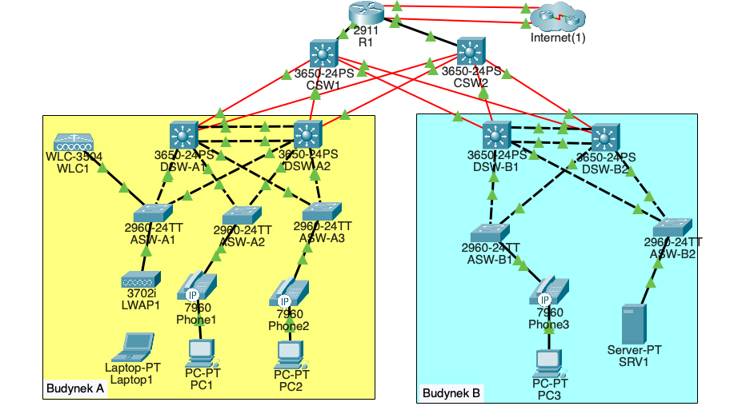

# 3-Tier Campus Network Architecture (Cisco Packet Tracer)

Projekt sieci kampusowej w architekturze 3-tier (Core / Distribution / Access) zrealizowany w Cisco Packet Tracer. Topologia obejmuje dwa budynki (A i B), redundancję w warstwie Core/Distribution oraz segmentację usług: DATA / VOICE / Wi-Fi / MGMT / SERVERS.

## Summary:
Zaimplementowane: VLAN + trunking, Inter-VLAN routing (SVI), OSPF area 0 (p2p /30), centralny DHCP + DHCP relay (ip helper-address), NAT (PAT + static NAT), Rapid-PVST root split, EtherChannel (PAgP/LACP), L2 security (DHCP snooping, DAI, port-security, BPDU Guard), VoIP (voice VLAN), WLAN (WLC + AP), IPv6 na uplinkach.

---

## Architektura

Edge
- R1 (2911): router brzegowy z dwoma łączami do ISP (primary/backup)
- Usługi: DHCP dla VLAN (A/B/Wi-Fi/Voice/Mgmt), NAT (PAT + static NAT), OSPF + rozgłaszanie trasy domyślnej, IPv6

Core
- CSW1, CSW2 (3650): L3 core (ip routing), routed links /30, OSPF area 0

Distribution
- Budynek A: DSW-A1, DSW-A2 (3650) – SVI + inter-VLAN routing, OSPF uplinki do core, EtherChannel do access, Rapid-PVST root split
- Budynek B: DSW-B1, DSW-B2 (3650) – SVI + inter-VLAN routing, OSPF uplinki do core, EtherChannel do access, Rapid-PVST root split

Access
- Budynek A: ASW-A1/A2/A3 (2960) – hardening L2, porty data/voice, uplinki trunk
- Budynek B: ASW-B1/B2 (2960) – hardening L2, porty data/voice, port serwerowy w VLAN 30

Dodatkowo
- WLC1, LWAP1, laptopy/PC, telefony IP (Cisco 7960), serwer SRV1

---

## VLAN & IP plan

Budynek A (SVI na DSW-A1/DSW-A2)
| VLAN | Rola | Subnet | DSW-A1 SVI | DSW-A2 SVI |
|---:|---|---|---|---|
| 10 | A-PC (DATA) | 10.1.0.0/24 | 10.1.0.2 | 10.1.0.3 |
| 20 | A-Phone (VOICE) | 10.2.0.0/24 | 10.2.0.2 | 10.2.0.3 |
| 40 | Wi-Fi | 10.6.0.0/24 | 10.6.0.2 | 10.6.0.3 |
| 99 | A-Mgmt | 10.0.0.0/28 | 10.0.0.2 | 10.0.0.3 |

Budynek B (SVI na DSW-B1/DSW-B2)
| VLAN | Rola | Subnet | DSW-B1 SVI | DSW-B2 SVI |
|---:|---|---|---|---|
| 10 | B-PC (DATA) | 10.3.0.0/24 | 10.3.0.2 | 10.3.0.3 |
| 20 | B-Phone (VOICE) | 10.4.0.0/24 | 10.4.0.2 | 10.4.0.3 |
| 30 | Servers | 10.5.0.0/24 | 10.5.0.2 | 10.5.0.3 |
| 99 | B-Mgmt | 10.0.0.16/28 | 10.0.0.18 | 10.0.0.19 |

DHCP jest realizowany centralnie na R1 (10.0.0.76), a SVI na DSW używają ip helper-address 10.0.0.76.

---

## Routing (OSPF)
- OSPF process 1, area 0
- Routed links /30 pomiędzy:
  - R1 ↔ Core (CSW1/CSW2)
  - Core ↔ Distribution (DSW-A1/A2, DSW-B1/B2)
- R1 rozgłasza trasę domyślną do kampusu (default-information originate)

---

## DHCP
Na R1 skonfigurowano pule DHCP dla:
- 10.1.0.0/24 (A-PC), 10.2.0.0/24 (A-Phone)
- 10.3.0.0/24 (B-PC), 10.4.0.0/24 (B-Phone)
- 10.6.0.0/24 (Wi-Fi)
- 10.0.0.0/28 (A-Mgmt), 10.0.0.16/28 (B-Mgmt)
DNS: 10.5.0.4, domena: MyITProject
Option 43 w puli A-Mgmt (dla scenariusza AP/WLC discovery).

---

## NAT + Internet
- Dwa łącza do ISP (primary/backup) + statyczne trasy domyślne (backup AD=2)
- PAT (overload) przez pulę publiczną 203.0.113.200-203.0.113.207/29 dla sieci użytkowników
- Static NAT: 10.5.0.4 → 203.0.113.113

---

## STP & EtherChannel

Rapid-PVST root split
Budynek A
- DSW-A1 root primary dla VLAN 10,99
- DSW-A2 root primary dla VLAN 20,40

Budynek B
- DSW-B1 root primary dla VLAN 10,99
- DSW-B2 root primary dla VLAN 20,30

EtherChannel
- Budynek A: Po1 (PAgP desirable) trunk native VLAN 1000, allowed 10/20/40/99
- Budynek B: Po1 (LACP active) trunk native VLAN 1000, allowed 10/20/30/99

---

## Access Layer security (L2 hardening)
Na przełącznikach access zastosowano:
- DHCP Snooping (per VLAN) + trusted uplinks
- Dynamic ARP Inspection (DAI) + walidacja MAC/IP
- Port-security (sticky MAC, violation restrict, max 2 dla portów PC+Phone)
- STP protections: PortFast + BPDU Guard
- trunk uplinki: switchport nonegotiate

Porty przykładowe
- ASW-A2/ASW-A3/ASW-B1: access VLAN 10 + voice VLAN 20 (PC + IP Phone)
- ASW-B2: access VLAN 30 (port serwerowy)

---

## Test plan (najważniejsze testy)
L2
- show vlan brief
- show interfaces trunk
- show etherchannel summary

OSPF / routing
- show ip ospf neighbor (na core i distribution; stan FULL)
- show ip route (sprawdź trasę domyślną 0.0.0.0/0 rozgłaszaną z R1)

DHCP
- host w VLAN 10/30 dostaje adres z właściwej puli + DNS 10.5.0.4

E2E
- inter-VLAN: PC (VLAN10) ↔ SRV1 (VLAN30)
- Internet: ruch wychodzący przez NAT + show ip nat translations na R1

---

## Limitations (Packet Tracer)
- FHRP (HSRP/VRRP) nie jest użyte w projekcie ze względu na ograniczenia/niestabilność wsparcia w Packet Tracer. Redundancja jest realizowana przez podwójny Core/Distribution, OSPF oraz STP root split.

---

## Autor
Antoni Gąsiorowski
